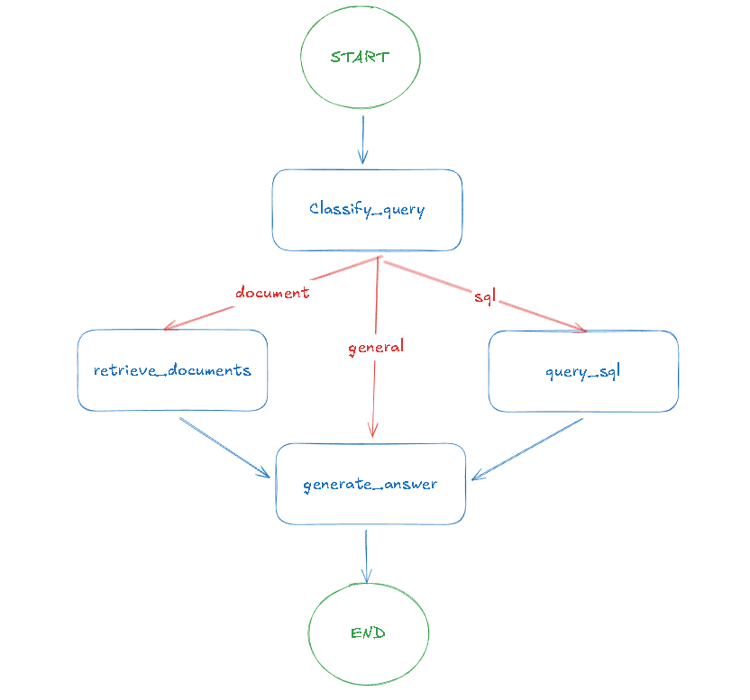
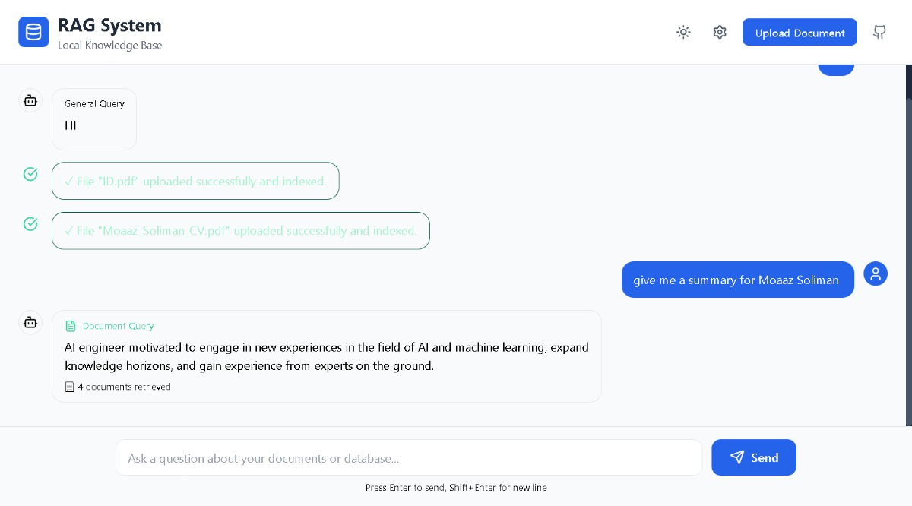
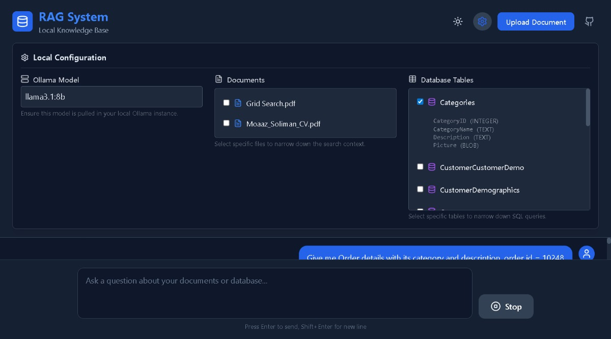

# Overview
Privacy-focused RAG system that runs entirely offline:
- using Ollama LLMs.
- Implemented LangGraph to orchestrate an intelligent workflow that switches between
- Vector Search (PDF/TXT) and SQL generation based on query intent.
-------
# Tools
- Python (FastAPI,LangChain, LangGraph, DSPy)
- JavaScript, TailwindCSS, REACT.JS
- Ollama Local Models
- PostMan
-----
# API's
1. `/api/query`
2. `/api/document`
3. `/api/upload`
4. `/api//tables`
5. `/api/health`
-----------------
# Workflow (LangGraph)

----
# Screenshots


------------
# Setup
### Download OLLAMA and PULL Model
1. Download and install Ollama Locally from [here](https://ollama.com/download)
2. Pull The Model `llama3.1:8b`
```bash
ollama pull llama3.1:8b
```
### Setup Environment Variable.
1. Rename `.env.example` to `.env`.
```bash
cp .env.example .env
```
2. Setup Your Variables.
- You can pull any model you want, but you will have to change `LLM_MODEL` = `Your Model Name`
- You can direct `DATABASE_PATH` to your local database by using the absolute path.

### Install Requirements
1. Make a virtual environment and activate it.
```bash
python -m venv .venv
./.venv/Scripts/activate
```
2. Install requirements inside the venv.
```bash
pip install -r requirements.txt
```
### Install Node.js
1. Download and install Node.Js from [here](https://nodejs.org/en/download/current)
2. Make sure you installed it by using this command.
```bash
npm --version
```
### Install React.JS
```bash
cd frontent
npm i
```

------------
# Run the system.
**Open Two Terminals**
1. Run the FASTAPI Services.
```bash
cd backend
uvicorn main:app --reload --host 0.0.0.0 --port 5000
```
2. Run the REACT Frontend
```bash
cd frontend
npm run
```

3. Access Application from here [http://localhost:5173/](hhttp://localhost:5173/)